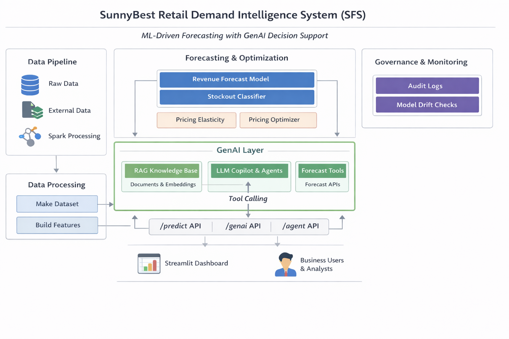
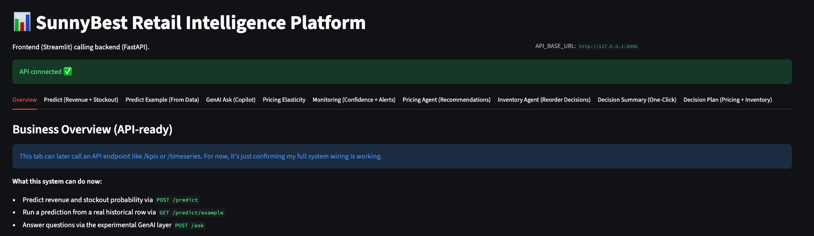

# 🧠 AI-Powered Demand, Operations & Forecasting Intelligence System 
## 📦 SunnyBest Telecommunications *(Synthetic Case Study)*

An end-to-end **AI, Machine Learning, and Generative AI–driven retail analytics platform** built for a **telecom and consumer electronics retailer — SunnyBest Telecommunications**.

This project demonstrates how modern data science, forecasting, pricing analytics, and **Generative AI (RAG + LLMs)** can be combined into a single system to support **real-world retail decision-making**, rather than isolated models or dashboards.

---
# 🏗️ System Architecture




## 📸 System Snapshot


### 📊 Streamlit Dashboard – Business Overview


### 🤖 Prediction Flow – UI Calling API


---

## 🎯 Project Aim

The aim of this project is to demonstrate how an **AI-powered analytics platform** can support retail decision-making across **demand forecasting, inventory risk management, promotion effectiveness, and pricing optimisation**.

The system integrates traditional analytics, machine learning models, and **Generative AI (RAG + LLMs)** to produce **actionable and explainable insights** that are accessible to both **technical and non-technical stakeholders**.

---

## 🏪 Business Context

SunnyBest Telecommunications operates retail outlets across:

**Benin, Ekpoma, Auchi, Irrua, Igueben, Agenebode, Ogwa  
(Edo State, Nigeria)**

Like many multi-store retailers, the business faces recurring operational and strategic challenges:

- Demand volatility and strong seasonal patterns  
- Stock-outs leading to lost revenue and poor customer experience  
- Uncertainty around promotion effectiveness and return on investment  
- Pricing decisions that directly affect demand and profitability  
- Limited access to insights for non-technical decision-makers  

This project simulates how an **AI-enabled retail analytics platform** could address these challenges by turning raw data into **decision-ready intelligence**.

---

## 🎯 Project Objectives

- Design a **production-style analytics and ML system**, from raw data ingestion to business insights  
- Apply **time-series forecasting** techniques to model retail demand  
- Predict **stock-out risk** using supervised machine learning  
- Analyse **promotion uplift** and pricing behaviour through modelling and simulation  
- Experiment with **Generative AI (RAG + LLMs)** to translate analytical outputs into natural-language insights  
- Structure the project for **API, Docker, and cloud-ready deployment**  

---

## 🔍 What This Project Demonstrates

- ✔ Synthetic retail data generation (sales, inventory, promotions, weather, calendar effects)  
- ✔ Exploratory Data Analysis (EDA) to understand demand patterns and drivers  
- ✔ Baseline and machine-learning-based demand forecasting  
- ✔ Stock-out prediction using classification models  
- ✔ Pricing analytics, elasticity modelling, and optimisation experiments  
- ✔ GenAI-assisted analytics using Retrieval-Augmented Generation (RAG) concepts  
- ✔ A production-oriented project structure with clear separation between experimentation, modelling, and deployment  

---

## 🧩 How to Think About This Project

This is **not** a single-model or accuracy-focused exercise.  
It is a **decision intelligence system** that demonstrates how analytics, ML, and GenAI can work together to answer questions such as:

- *What will demand look like next month, and why?*  
- *Which products are at risk of stock-out?*  
- *Are promotions actually driving incremental sales?*  
- *How sensitive is demand to price changes?*  
- *How can insights be explained clearly to non-technical stakeholders?*  

---


## 📈 Key Findings (Summary)

- Machine learning–based demand forecasting outperforms baseline statistical models across evaluation metrics.
- Stock-out risk is highest in high-demand product categories and in smaller store formats.
- Promotions increase demand but also significantly raise the likelihood of stock-outs if inventory is not proactively managed.
- Demand for several categories appears relatively price-inelastic within the tested pricing ranges.
- Uniform discounting strategies are sub-optimal; category-specific pricing approaches consistently perform better.


---

## 🧪 Demo Flow (How to Use the System)

1. Launch the Streamlit dashboard.
2. View high-level business KPIs, including:
   - Total revenue  
   - Units sold  
   - Stock-out rate
3. Explore historical demand patterns and baseline forecasting results.
4. Identify product categories and store locations with elevated stock-out risk.
5. Analyse pricing behaviour and revenue sensitivity through simulation.
6. *(Experimental)* Query the GenAI layer to generate natural-language explanations of analytical outputs.

![

---
## 🚀 How to Run the System

This project can be run locally for fast development and debugging, or via Docker for full system orchestration.

### 🔹 Option 1: Local Development (Recommended for iteration)
Run the API and dashboard directly on your machine.  
This is ideal for rapid development, debugging, and experimentation.

```bash
pip install -r requirements.txt
python -m uvicorn src.api.app:app --reload --port 8000
streamlit run src/dashboards/streamlit_app.py

- **API Docs (Swagger):** http://localhost:8000/docs  
- **Dashboard:** http://localhost:8501  
```
---

### 🔹 Option 2: Docker (End-to-End System)

Run the full system using Docker Compose.  
This mirrors a production-style setup with isolated services and shared networking.

```bash
docker compose up --build
```
Stop all services:

```bash
docker compose down
```
---

## 🚀 Quick Demo (One Command)

To run the full system end-to-end using Docker:
```bash
./scripts/demo.sh

```

---

## 🚦 Implementation Status

| Component | Status | Notes |
|---------|--------|-------|
| Repository structure | ✅ Implemented | Modular, scalable layout |
| Synthetic data generation | ✅ Implemented | Retail-like dataset |
| Exploratory Data Analysis | ✅ Implemented | EDA notebooks completed |
| Baseline forecasting | ✅ Implemented | Statistical benchmarks |
| ML forecasting (XGBoost) | ✅ Implemented | Model trained & evaluated |
| Stock-out classification | ✅ Implemented | Binary classifier |
| Pricing analysis | ⚠️ Partial | Elasticity & optimisation notebooks |
| GenAI RAG experiments | ⚠️ Experimental | Notebook-based exploration |
| FastAPI backend | ✅ Implemented | API scaffold designed |
| Dockerisation | ✅ Implemented | To containerise API & dashboard |
| AWS deployment | 🛠 Planned | EC2 / S3 / future MLOps |

---

## 🤖 Generative AI (GenAI) Layer

Generative AI is used as an **explanation and decision-support layer**, not as a replacement for statistical or machine learning models.

### Current capabilities include:
- Retrieval-Augmented Generation (RAG) over analytical outputs
- Natural-language explanations of forecasts, pricing behaviour, and stock-out risks
- Experimental insight summarisation for non-technical stakeholders

> **Note:**  
> Agent-based orchestration is intentionally included as a *planned extension* rather than a core dependency at the current stage of the project.

---

## 🧭 Analytical Components

### 📊 Forecasting
- Baseline statistical models
- Machine learning forecasting (XGBoost)
- Evaluation using appropriate error metrics

### 📦 Stock-Out Prediction
- Binary classification of stock-out risk
- Feature engineering from sales, inventory & promotions

### 💰 Pricing Analytics
- Price elasticity modelling
- Revenue / profit optimisation scenarios
- What-if pricing simulations

### 🤖 GenAI Insight Experiments
- Retrieval-Augmented Generation (RAG)
- Natural-language questions over retail data
- LLM-based explanation prototypes (experimental)

---

## 🧭 Future Enhancements

- Full integration between the Streamlit dashboard and the FastAPI backend
- Automated model retraining pipelines and performance monitoring
- Cloud deployment on AWS (e.g. EC2, S3, and managed services)
- Richer Generative AI decision-support workflows
- User-specific dashboards and access control mechanisms

---

## 📁 Project Structure
```text
sunnybest-ai-forecasting-intelligence/
├── README.md
├── pyproject.toml
├── requirements.txt
├── .gitignore
├── Makefile

├── docs/
│   ├── system_overview.md
│   ├── business_context.md
│   ├── data_model.md
│   ├── data_dictionary.md
│   ├── forecasting_targets.md
│   ├── methodology.md
│   ├── assumptions.md
│   ├── api_reference.md
│   ├── changelog.md
│   └── roadmap.md

├── data/
│   ├── raw/
│   │   ├── foundation/
│   │   │   ├── sunnybest_stores.csv
│   │   │   ├── sunnybest_products.csv
│   │   │   ├── sunnybest_calendar.csv
│   │   │   └── sunnybest_weather.csv
│   │   │
│   │   ├── transactions/
│   │   │   ├── sunnybest_sales.csv
│   │   │   ├── sunnybest_inventory.csv
│   │   │   └── sunnybest_promotions.csv
│   │   │
│   │   ├── behaviour_operations/
│   │   │   ├── sunnybest_customer_activity.csv
│   │   │   └── sunnybest_store_operations.csv
│   │   │
│   │   └── policy_constraints/
│   │       ├── sunnybest_policy_regimes.csv
│   │       └── sunnybest_restriction_events.csv
│   │
│   ├── processed/                  # gitignored
│   ├── external/
│   └── knowledge/                 # AI/RAG knowledge base
│       ├── chunks.jsonl
│       └── embeddings.npz

├── notebooks/
│   ├── 01_data_understanding.ipynb
│   ├── 02_eda_system_overview.ipynb
│   ├── 03_feature_engineering.ipynb
│   ├── 04_demand_forecasting_baseline.ipynb
│   ├── 05_ml_forecasting_xgboost.ipynb
│   ├── 06_inventory_and_stockout_analysis.ipynb
│   ├── 07_promotion_and_price_effects.ipynb
│   ├── 08_operational_workload_analysis.ipynb
│   ├── 09_policy_impact_analysis.ipynb
│   ├── 10_scenario_planning.ipynb
│   └── 11_genai_rag_experiments.ipynb

├── src/
│   ├── __init__.py

│   ├── config/
│   │   ├── settings.py
│   │   ├── constraints.yaml
│   │   └── registry.yaml

│   ├── data/
│   │   ├── loaders.py
│   │   ├── joins.py
│   │   └── make_dataset.py

│   ├── validation/
│   │   ├── schema_checks.py
│   │   ├── data_quality.py
│   │   └── business_rules.py

│   ├── features/
│   │   ├── build_features.py
│   │   ├── demand_features.py
│   │   ├── calendar_features.py
│   │   ├── promo_features.py
│   │   ├── inventory_features.py
│   │   └── operational_features.py

│   ├── forecasting/
│   │   ├── train.py
│   │   ├── predict.py
│   │   ├── evaluate.py
│   │   ├── backtest.py
│   │   ├── pipelines.py
│   │   └── registry.py

│   ├── operations/
│   │   ├── kpis.py
│   │   ├── service_metrics.py
│   │   ├── workload_analysis.py
│   │   ├── bottlenecks.py
│   │   └── operational_risk.py

│   ├── inventory/
│   │   ├── stockout_model.py
│   │   ├── replenishment.py
│   │   ├── service_level.py
│   │   └── risk_scoring.py

│   ├── pricing/
│   │   ├── elasticity.py
│   │   ├── build_elasticity.py
│   │   └── optimizer.py

│   ├── policy/
│   │   ├── policy_engine.py
│   │   ├── policy_effects.py
│   │   └── constraint_application.py

│   ├── planning/
│   │   ├── scenario_engine.py
│   │   ├── what_if.py
│   │   ├── assumptions.py
│   │   ├── capacity_planning.py
│   │   └── plan_generation.py

│   ├── ai/
│   │   ├── copilot.py
│   │   ├── prompts.py
│   │   ├── prompt_registry.py
│   │   ├── openai_client.py
│   │   ├── schemas.py
│   │
│   │   ├── rag/
│   │   │   ├── build_kb.py
│   │   │   ├── store.py
│   │   │   └── retrieve.py
│   │
│   │   ├── tools/
│   │   │   └── forecast_tools.py
│   │
│   │   └── services/
│   │       ├── rag_qa.py
│   │       └── assistant.py

│   ├── agents/
│   │   ├── base.py
│   │   ├── pricing_agent.py
│   │   ├── promo_agent.py
│   │   ├── inventory_agent.py
│   │   └── policies.py

│   ├── monitoring/
│   │   ├── metrics.py
│   │   ├── drift.py
│   │   ├── rules.py
│   │   └── store.py

│   ├── governance/
│   │   ├── audit_log.py
│   │   ├── schemas.py
│   │   ├── fairness.py
│   │   └── explainability.py

│   ├── api/
│   │   ├── app.py
│   │   └── routes/
│   │       ├── predict.py
│   │       ├── agents.py
│   │       ├── monitoring.py
│   │       └── ai.py

│   ├── dashboard/
│   │   └── streamlit_app.py

│   ├── spark/
│   │   ├── spark_session.py
│   │   ├── spark_etl.py
│   │   ├── spark_aggregations.py
│   │   └── spark_feature_engineering.py

│   └── warehouse/
│       ├── staging.sql
│       ├── marts.sql
│       ├── queries.sql
│       └── schema.sql

├── models/
│   ├── demand_forecast.pkl
│   └── stockout_model.pkl

├── monitoring/
│   ├── predictions_log.csv
│   ├── forecast_metrics.csv
│   ├── drift_report.csv
│   ├── agent_decisions.csv
│   └── human_overrides.csv

├── docker/
│   ├── Dockerfile
│   └── Dockerfile.streamlit

├── scripts/
│   ├── run_pipeline.sh
│   └── demo.sh

├── infra/
│   └── terraform/

├── tests/
│   ├── test_data.py
│   ├── test_features.py
│   ├── test_forecasting.py
│   ├── test_operations.py
│   ├── test_policy.py
│   ├── test_api.py
│   └── test_ai.py

└── assets/
    ├── architecture.png
    └── screenshots/

```

## Optional Scaling Layer: Spark + Warehouse (Snowflake)

> **Note on Spark:**  
> This project does not strictly require Spark at its current scale. I included Spark as an optional processing layer to demonstrate how the pipeline could evolve in production as data volumes grow. The core modelling remains in pandas to support faster iteration during development.

---

### Why Spark?
As SunnyBest expands (more stores, more SKUs, higher transaction volume), batch ETL and feature engineering can exceed single-machine limits. Spark provides:
- Distributed data processing for large datasets
- Scalable ETL pipelines (joins, aggregations, feature generation)
- A clean path to production data platforms

### How this fits in the pipeline
- **Current (local / prototyping):** CSV → pandas notebooks → models  
- **Scaled (production concept):** Raw data → Spark ETL → curated tables → warehouse (e.g., Snowflake) → models & dashboards

### Repository components
- `notebooks/09_spark_data_processing.ipynb` – Spark ETL demonstration (optional)
- `src/spark/` – Spark utilities (session, ETL, aggregations, feature engineering)
- `src/warehouse/` – Example SQL for warehouse staging + marts (conceptual)
